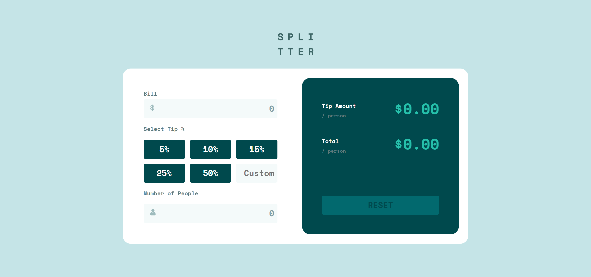
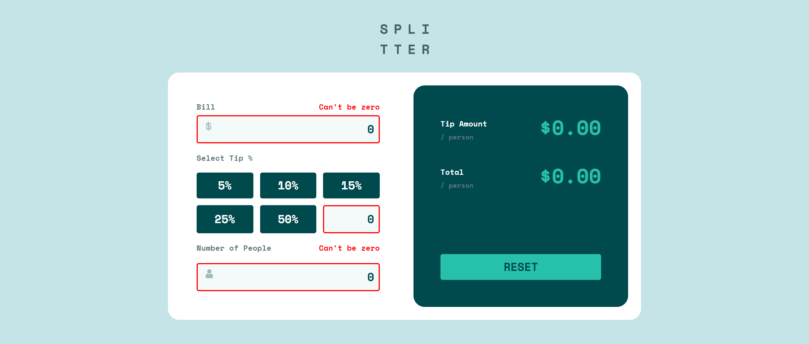
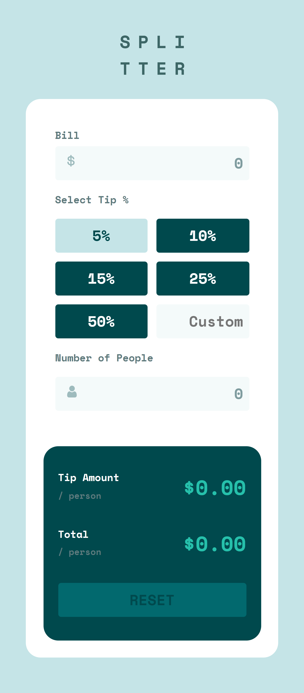

# Frontend Mentor - Tip calculator app solution

This is a solution to the [Tip calculator app challenge on Frontend Mentor](https://www.frontendmentor.io/challenges/tip-calculator-app-ugJNGbJUX). Frontend Mentor challenges help you improve your coding skills by building realistic projects.

## Table of contents

- [Overview](#overview)
  - [The challenge](#the-challenge)
  - [Screenshot](#screenshot)
  - [Links](#links)
- [My process](#my-process)
  - [Built with](#built-with)
  - [What I learned](#what-i-learned)
  - [Continued development](#continued-development)
  - [Useful resources](#useful-resources)
- [Author](#author)

## Overview

This challenge was unlike anything I have done before. I thought it would be very simple at first, but then I got to writing the functionality and I discovered that there was a lot going on in this "simple" tip calculator. 

The calculator needed more than just a basic math function. It needed validation for the inputs, which is honestly the most challenging part, and a way to reset all the parameters. 

It was a very interesting project nontheless. It really challenged my logic and forced me to learn new things. I believe it has made me a better programmer.

### The challenge

Users should be able to:

- View the optimal layout for the app depending on their device's screen size
- See hover states for all interactive elements on the page
- Calculate the correct tip and total cost of the bill per person

### Screenshot

Desktop

Desktop - Active

Mobile

### Links

- Frontend Mentor - [@dxiDavid](https://www.frontendmentor.io/profile/dxiDavid)
- Live Site URL: [Go Live](https://dxidavid.github.io/tip-calculator-app-challenge/)

## My process

I started with a slightly styled page then moved on to the JS logic for the calculator. Once I got that working, I finished building the different layouts and tried to get as close to the design as possible. I did encounter a few problems with JS at first but it was nothing I couldn't handle. I got it to work the best way I could and I'm happy with the result.

### Built with

- Semantic HTML5 markup
- CSS custom properties
- Flexbox
- CSS Grid
- Mobile-first workflow

### What I learned

- I learned how to take values from inputs and convert them into the appropriate numbers to use for calculations.
- I also did a refresher on math operations and got to use the ``parseFloat()``,  ``Number()``, and the ``toFixed()`` methods to get the calculator to work.
- I learned a few additional event listeners like ``keydown`` to listen for a keyboard event accompanied by the ``key`` property which you can set to the code for a specific key, in my case the enter key.
- I also learned how to enable and disable a button using the ``.disabled`` property which is a boolean.
- I practised using CSS Grid to get more comfortable with it.

### Continued development

I might come back and try the same thing with CSS and JS frameworks

### Useful resources

- [Youtube](https://www.youtube.com/@KevinPowell) - This is where I found the best tutorials and explanations (For me) on CSS concepts and      writing functional CSS. Kevin Powel really knows his stuff and gives concise explanations.
- [w3schools](https://w3schools.com) - This website has an entire course on JavaScript with simple examples for both basic and advanced concepts.
- [CSS Tricks](https://css-tricks.com/) - This website provides very well written explanations to CSS concepts as well as examples for when you need to revisit a concept.
- [mdn](https://developer.mozilla.org/en-US/) - Always helpful to read the documentation of any language.

## Author

- Frontend Mentor - [@dxiDavid](https://www.frontendmentor.io/profile/dxiDavid)
- Twitter - [@dxidavid254](https://www.twitter.com/dxidavid254)
